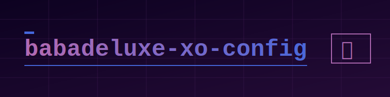

# @babadeluxe/xo-config

<p align="left">
  
  
  
  
  
</p>

## Overview

It’s quite a remarkable thing, isn't it? The way we craft these digital architectures. When we step back and look at the patterns of our code, we’re essentially looking at a map of our own cognitive processes. This configuration is my attempt—or perhaps our collective attempt—to bring a certain level of harmony and emergent clarity to that process.

The `@babadeluxe/xo-config` provides a unified, pre-configured environment for [XO](https://github.com/xojs/xo), specifically tuned for TypeScript and Vue development. It’s about reducing the friction between thought and expression, ensuring that the structural integrity of your projects remains sound as they evolve toward greater complexity.

## Quick start

To integrate this configuration into your environment, you’ll need to install the package along with its peer dependencies. It's a simple alignment of resources:

```bash
npm install --save-dev @babadeluxe/xo-config xo @typescript-eslint/eslint-plugin @typescript-eslint/parser
```

## Usage

Once the dependencies are in place, you can point your XO configuration to this shared foundation. Update your `package.json` or your `xo.config.js`:

### package.json

```json
{
  "xo": {
    "extends": "@babadeluxe/xo-config"
  }
}
```

### Dedicated config

If you prefer a standalone configuration file, you can import it directly:

```typescript
// xo.config.ts
import babadeluxeConfig from '@babadeluxe/xo-config'

export default babadeluxeConfig
```

## Features

This configuration isn't just a list of rules; it's a curated set of constraints designed to foster better code:

- **TypeScript optimization**: Deeply integrated rules for `@typescript-eslint`.
- **Prettier alignment**: Seamless integration with Prettier for aesthetic consistency.
- **Vue support**: Tailored rules for `.vue` files to handle the nuances of component-based architecture.
- **Modern standards**: Enforces ESM, modern syntax, and sensible naming conventions.

## License

This project is released under the [MIT License](LICENSE). It's open, it's free, and it's part of the global knowledge commons.
